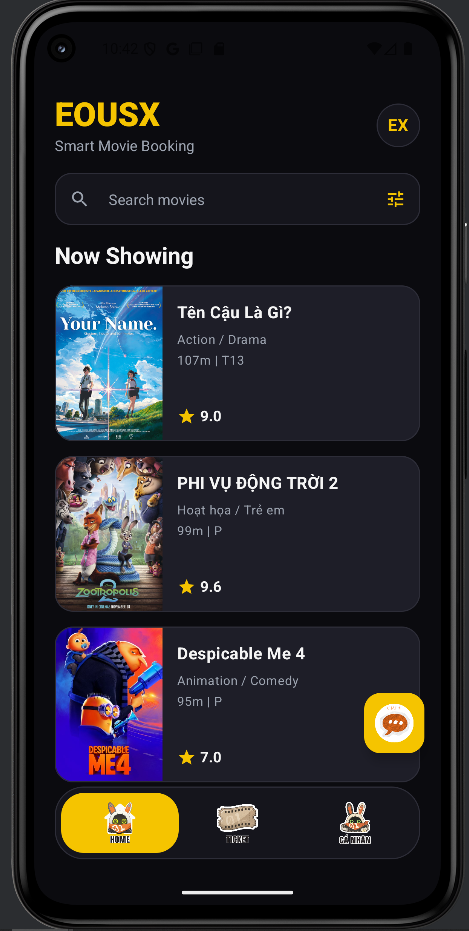
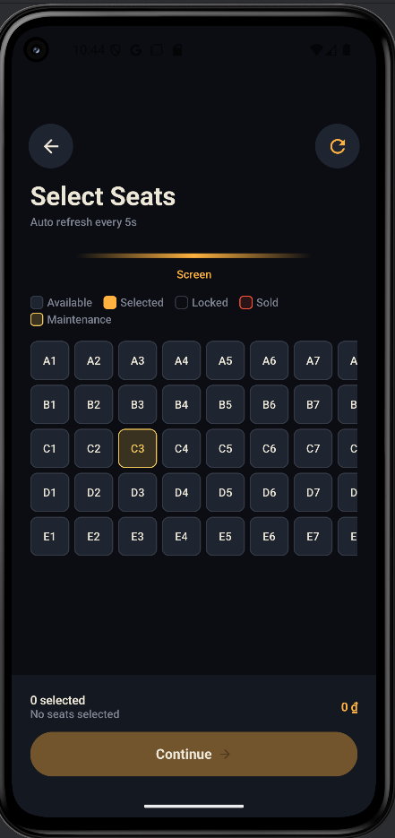
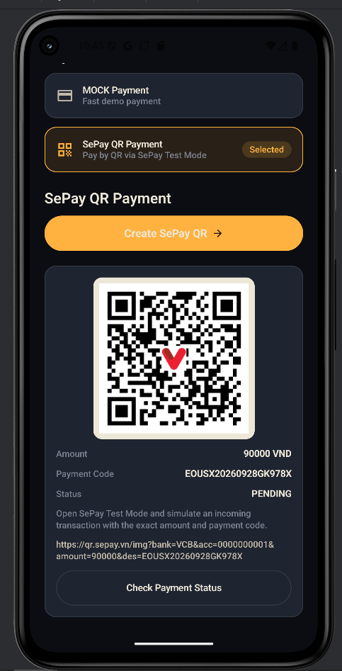
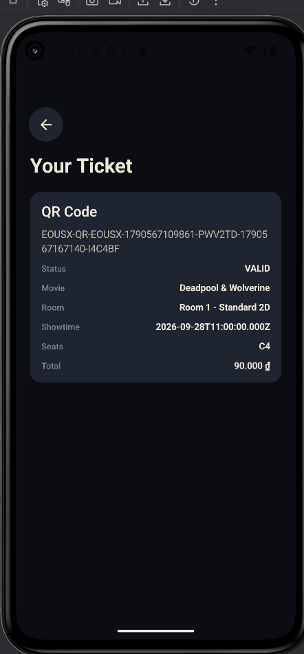
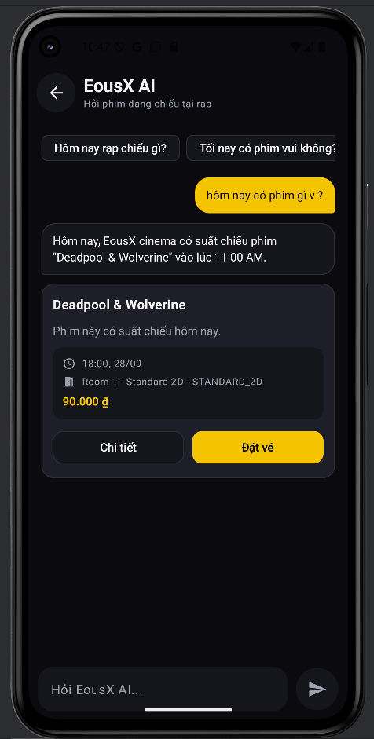
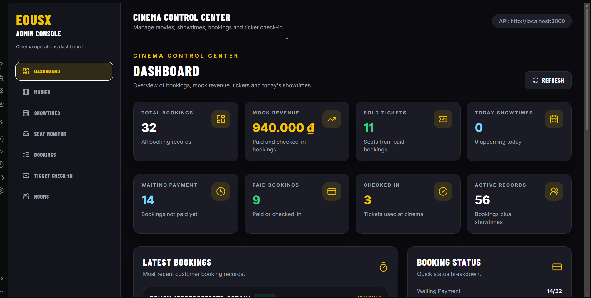
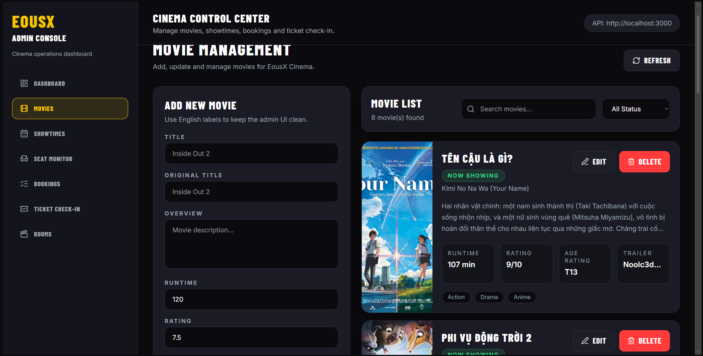
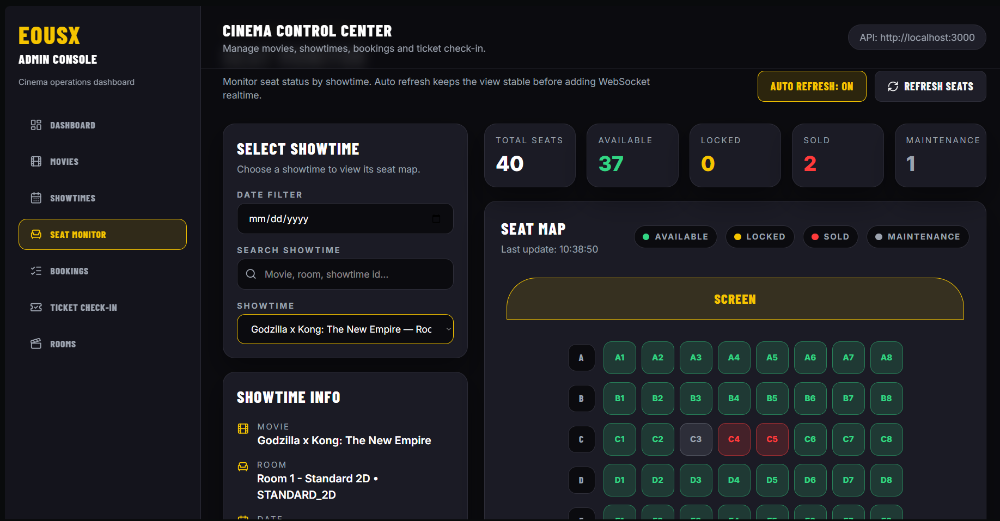
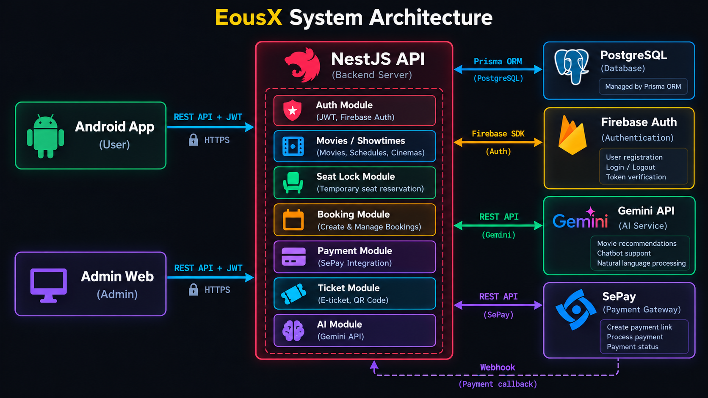
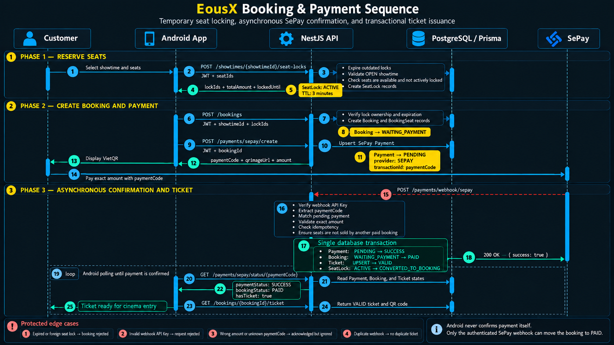

# EousX — Transactional Cinema Ticketing Platform

> A full-stack, transactional cinema ticketing platform featuring distributed seat-locking concurrency control, asynchronous VietQR payment reconciliation, complete ticket lifecycle management, and backend-orchestrated AI movie discovery.

[](client-app/)
[](api-server/)
[](api-server/prisma/)
[](admin-web/)
[](docs/payment/sepay-payment-backend-summary.md)
[](api-server/src/ai/)

[Demo & Showcase](#demo--visual-showcase) • [Features](#implemented-features) • [System Architecture](#system-architecture) • [Booking Sequence](#booking-and-payment-sequence) • [Quick Start](#quick-start) • [Documentation](docs/) • [Team](#team--course-information)

---

## Demo & Visual Showcase

<p align="center">
  
</p>

<p align="center"><strong>Browse currently showing movies from the Android customer app.</strong></p>

### Android Customer Journey

<table>
  <tr>
    <td align="center" width="50%">
      <br>
      <strong>1. Select seats</strong><br>
      <sub>Check live availability and reserve seats before checkout.</sub>
    </td>
    <td align="center" width="50%">
      <br>
      <strong>2. Pay with SePay</strong><br>
      <sub>Generate a VietQR payment with an exact amount and payment code.</sub>
    </td>
  </tr>
  <tr>
    <td align="center" width="50%">
      <br>
      <strong>3. Receive the ticket</strong><br>
      <sub>Turn a confirmed booking into a valid cinema ticket.</sub>
    </td>
    <td align="center" width="50%">
      <br>
      <strong>4. Discover with AI</strong><br>
      <sub>Get movie recommendations grounded in available showtimes.</sub>
    </td>
  </tr>
</table>

### Admin Operations

<table>
  <tr>
    <td align="center" width="33%">
      <br>
      <strong>Dashboard</strong><br>
      <sub>Track bookings, revenue, tickets, and showtimes.</sub>
    </td>
    <td align="center" width="33%">
      <br>
      <strong>Movie Management</strong><br>
      <sub>Create, update, search, and manage the movie catalog.</sub>
    </td>
    <td align="center" width="33%">
      <br>
      <strong>Seat Monitor</strong><br>
      <sub>Monitor available, locked, sold, and maintenance seats.</sub>
    </td>
  </tr>
</table>

## Monorepo Structure

```text
EousX-Movie-Booking-AI/
  api-server/   # NestJS API, Prisma, PostgreSQL, auth, booking, AI
  client-app/   # Android customer app
  admin-web/    # React admin dashboard
  docs/         # Supporting project notes and reports
  README.md
```

## Main Modules

| Module | Purpose |
|---|---|
| `api-server/` | Business logic, JWT auth, Firebase Google login verification, movie/showtime/seat/booking/payment/ticket APIs, AI chat orchestration. |
| `client-app/` | Android customer flow: login, browse movies, choose showtime/seats, payment (SePay QR or mock-success), ticket, history, AI chat. |
| `admin-web/` | Admin/operator flow: dashboard, movies, showtimes, seat monitor, bookings, ticket check-in. |

## Tech Stack

| Area | Stack |
|---|---|
| Backend | NestJS, TypeScript, Prisma, PostgreSQL, JWT, Firebase Admin, Gemini API |
| Android | Kotlin, Jetpack Compose, Hilt, Retrofit/Moshi/OkHttp, Coroutines/StateFlow, DataStore, Firebase Auth |
| Admin Web | React, Vite, TypeScript, Tailwind CSS, Axios, React Router, TanStack Query |

## Implemented Features

- Email/password register and login
- Google login through Firebase ID token verification on the backend
- Movie browsing and movie details
- Showtime selection
- Seat map and temporary seat locking
- Booking creation and booking history
- Payment: SePay Test Mode (QR + webhook confirmation) and mock-success fallback
- Ticket generation, verification, and check-in
- AI movie assistant through backend `/ai/chat`
- Admin dashboard for the demo cinema flow

## System Architecture

<p align="center">
  
</p>

The Android app and admin dashboard use JWT-protected REST APIs. NestJS owns the business flow, Prisma persists transactional state in PostgreSQL, Firebase Admin verifies Google login tokens, Gemini powers backend-mediated movie discovery, and SePay confirms payments through a webhook.

The backend has no `/api` prefix. Example routes are `/auth/login`, `/movies`, `/bookings`, and `/ai/chat`.

## Booking and Payment Sequence

<p align="center">
  
</p>

Seats are locked for three minutes while the customer creates a booking and pays the exact VietQR amount. Only the authenticated SePay webhook can move the payment and booking to their successful states; the same database transaction issues the ticket, and the Android app polls until confirmation is available.

## AI Assistant

- Android does not call Gemini directly.
- Clients call `POST /ai/chat` with the EousX backend JWT.
- The backend builds an `AVAILABLE_MOVIES` context from real `OPEN` showtimes.
- Gemini recommendations are sanitized by the backend so only movies available in EousX showtimes are returned.

## API Overview

| Group | Example routes |
|---|---|
| Health | `GET /health` |
| Auth | `POST /auth/register`, `POST /auth/login`, `POST /auth/google`, `GET /auth/me` |
| Movies | `GET /movies`, `GET /movies/now-showing`, `GET /movies/upcoming`, `GET /movies/:id` |
| Rooms | `GET /rooms`, `GET /rooms/:id` |
| Showtimes | `GET /showtimes`, `GET /showtimes/:id`, `GET /movies/:movieId/showtimes?date=YYYY-MM-DD` |
| Seats | `GET /showtimes/:showtimeId/seats`, `GET /admin/showtimes/:showtimeId/seats` |
| Seat Locks | `POST /showtimes/:showtimeId/seat-locks`, `GET /seat-locks/:lockId`, `DELETE /seat-locks/:lockId` |
| Bookings | `POST /bookings`, `GET /bookings/me`, `GET /bookings/:id`, `PATCH /bookings/:id/cancel` |
| Payments | `POST /payments/sepay/create`, `POST /payments/webhook/sepay`, `GET /payments/sepay/status/:paymentCode`, `POST /payments/mock-success`, `GET /payments/:id/status`, `GET /bookings/:bookingId/payment` |
| Tickets | `GET /bookings/:bookingId/ticket`, `GET /tickets/verify/:qrCode`, `POST /tickets/:ticketId/check-in` |
| AI | `POST /ai/chat` |
| Admin | `/admin/movies`, `/admin/showtimes`, `/admin/bookings`, `/admin/rooms` |

## Database Overview

Core Prisma models:

- `User` owns customer bookings and seat locks.
- `Movie` has many showtimes.
- `Cinema` has rooms; `Room` has seats and showtimes.
- `Seat` belongs to a room. Sold/locked display status is calculated per showtime from bookings and active locks.
- `Showtime` belongs to a movie and room.
- `SeatLock` temporarily reserves a seat for a user and showtime.
- `Booking` belongs to a user and showtime.
- `BookingSeat` stores seats and prices for a booking.
- `Payment` belongs to one booking.
- `Ticket` belongs to one booking and stores the QR code/check-in state.

## Status Labels

| Enum | Values |
|---|---|
| `RoomType` | `STANDARD_2D`, `VIP`, `COUPLE` |
| `MovieStatus` | `NOW_SHOWING`, `UPCOMING`, `ENDED` |
| `ShowtimeStatus` | `OPEN`, `CLOSED`, `CANCELLED` |
| `SeatType` | `STANDARD`, `VIP`, `COUPLE`, `DISABLED`, `MAINTENANCE` |
| Seat display status | `AVAILABLE`, `LOCKED`, `SOLD`, `MAINTENANCE` |
| `SeatLockStatus` | `ACTIVE`, `EXPIRED`, `RELEASED`, `CONVERTED_TO_BOOKING` |
| `BookingStatus` | `PENDING`, `WAITING_PAYMENT`, `PAID`, `EXPIRED`, `CANCELLED`, `REFUNDED`, `CHECKED_IN` |
| `PaymentStatus` | `CREATED`, `PENDING`, `SUCCESS`, `FAILED`, `CANCELLED`, `EXPIRED` |
| `TicketStatus` | `VALID`, `USED`, `CANCELLED`, `EXPIRED` |
| `AdminRole` | `ADMIN`, `MANAGER`, `STAFF` |

## Quick Start

### Prerequisites

- Git, Node.js with npm, and Docker with Compose
- Ports `3000`, `5173`, and `5432` available locally
- Android Studio, JDK 17, and Android SDK 36 to run the Android app

### 1. Clone the repository

```powershell
git clone https://github.com/knight3007/EousX-Movie-Booking-AI.git
cd EousX-Movie-Booking-AI
```

### 2. Start PostgreSQL and the API

```powershell
Copy-Item api-server/.env.example api-server/.env
cd api-server
docker compose up --build --detach --wait
docker compose exec api npm run seed
```

The seed command resets the database before inserting demo data; run it only for a new or disposable local database. The API runs at `http://localhost:3000`. Verify it from another terminal:

```powershell
Invoke-RestMethod http://localhost:3000/health
```

The default environment template is enough for the email/password and mock-payment demo. Set `API_HOST_PORT` if port `3000` is already in use. Firebase Google login, Gemini AI, and SePay require their own credentials; see [API server setup](api-server/README.md#environment-variables).

### 3. Start the Admin Web

Open a new terminal from the repository root:

```powershell
cd admin-web
Copy-Item .env.example .env
npm ci
npm run dev
```

Open `http://localhost:5173`. The default admin configuration connects to `http://localhost:3000` without an `/api` prefix. See the [Admin Web README](admin-web/README.md) for its pages and environment options.

### 4. Run the Android app

1. Open `client-app/` in Android Studio and let Gradle sync.
2. Let Android Studio create `local.properties`, or copy `local.properties.example` and set `sdk.dir` to your Android SDK.
3. Register the Android application ID `com.uit.eousx` in Firebase, enable Google Sign-In, and place the downloaded configuration at `client-app/app/google-services.json`.
4. Start the API, then run the app on an emulator.

The emulator build already targets `http://10.0.2.2:3000/`. For a physical device, change the backend URL to `http://<your-computer-lan-ip>:3000/` in `BackendNetworkModule.kt`.

Command-line build after the local files are configured:

```powershell
cd client-app
.\gradlew.bat :app:assembleDebug
```

See the [Android Client README](client-app/README.md) for backend rules, routes, and local-file requirements.

### Optional integrations

| Integration | Additional setup |
|---|---|
| Google login | Firebase Android config plus a Firebase Admin service account on the API server. |
| AI assistant | Set `GEMINI_API_KEY` in `api-server/.env`. |
| SePay Test Mode | Configure the `SEPAY_*` variables and expose the webhook endpoint through a public URL. |
| Quick payment demo | No external provider required; use the authenticated mock-success flow. |

## Environment and Security

Local development may require:

- `api-server/.env`
- `api-server/firebase-service-account.json`
- `client-app/local.properties`
- `client-app/app/google-services.json`
- `admin-web/.env`

These files must not be committed. The root `.gitignore` is configured to ignore local environment files, Firebase service accounts, Google services JSON, private keys, build outputs, and dependency folders.

## Demo Flow

Customer:

```text
Login -> Browse movie -> Movie detail -> Showtime -> Seat map
      -> Booking -> Payment (SePay QR or mock-success) -> Ticket -> Booking history
```

Admin:

```text
Dashboard -> Movies -> Showtimes -> Seat Monitor -> Bookings -> Ticket Check-in
```

## Current MVP Status

- Payment supports two flows: SePay Test Mode (QR display + server-side webhook confirmation) and mock-success for quick demo. End-to-end SePay flow requires the SePay test environment and a running Cloudflare Tunnel or public endpoint for webhook delivery.
- Seat monitor uses polling in the admin web app.
- Admin routes are public in the current demo scope; admin authentication/authorization is future scope.
- Android ticket screen displays the QR code string returned by the backend; generated QR image rendering is future scope.
- Android uses the EousX backend as the movie source of truth. Movie metadata, trailer keys, posters, and backdrops should be managed by backend/admin data.

## Future Scope

- SePay Production Mode and additional payment gateways (ZaloPay, MoMo).
- Realtime seat updates with WebSocket.
- Advanced AI memory and stronger personalization.
- Admin authentication and role-based permissions.
- Analytics and reporting.

## Team & Course Information

- **University:** University of Information Technology (UIT, VNU-HCM)
- **Contributors:**
  - **Đỗ Thái Hậu** (23520450)
  - **Hoàng Xuân Đồng** (23520297)
- **Note:** This project is developed for learning, demonstration, and portfolio evaluation purposes.
